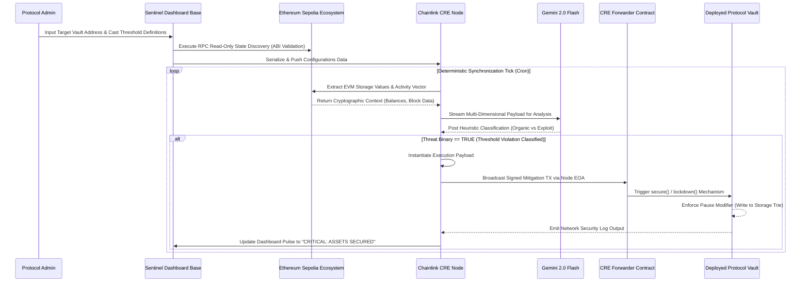

# Sentinel Web Interface

This is the frontend component of the **Sentinel CRE** project. It provides the user interface for protocol setup, AI reasoning logs, and security dashboards.

> 🚀 **IMPORTANT NOTE:** The Chainlink Runtime Environment (CRE) reasoning engine can be fully simulated and visualized directly within this frontend! After completing the setup operations via the Wizard, you can actively watch the autonomous AI agent analyze your contract and trigger lockdowns in real-time.

For full project documentation, setup instructions, and architecture overview, please refer to the [Root README](../README.md).

## Quick Start (Local Development)

```bash
npm run dev
```

Navigate to [http://localhost:3000](http://localhost:3000).


# 🛡️ Sentinel CRE: AI-Orchestrated Security Guardian

Sentinel CRE is an autonomous security solution designed to protect DeFi protocols and digital vaults from exploits, hacks, and extreme market volatility. By combining the **Chainlink Runtime Environment (CRE)** with **Gemini AI**, Sentinel provides 24/7 proactive monitoring and automated intervention.

---

## 🌟 Overview

In the fast-moving world of DeFi, minutes can mean millions. Sentinel CRE acts as a "Digital Bodyguard" for your smart contracts. Unlike traditional passive monitoring, Sentinel analyzes on-chain data in real-time using cutting-edge AI to detect anomalies and execute preemptive safeguards (like circuit breakers or withdrawal pauses) before malicious actors can drain assets.

### Key Capabilities
- **Autonomous Monitoring**: Continuous loops powered by Chainlink CRE.
- **AI Reasoning**: Gemini 2.0 Flash analyzes TVL shifts and provides "human-like" security reasoning.
- **On-Chain Action**: Automated triggers to pause or secure vaults via smart contract interactions.
- **Security Dashboard**: A premium, real-time interface for protocol owners to track security health.

---

## 🏗️ Technical Stack

- **Frontend**: [Next.js 15+](https://nextjs.org/) with Tailwind CSS (Premium Dark Mode UI).
- **Core Engine**: [Chainlink Runtime Environment (CRE)](https://docs.chain.link/cre).
- **Intelligence**: [Google Gemini 2.0 Flash](https://aistudio.google.com/) for risk analysis.
- **Connectivity**: [Ethers.js](https://docs.ethers.org/v6/) & [Viem](https://viem.sh/).
- **Blockchain**: Sepolia Testnet (Target Environment).

---

## 🚀 Getting Started

Sentinel is divided into two main components: the **Web Interface** and the **CRE Sentinel Node**.

### 1. Prerequisites
- **Node.js** (v18+) or **Bun**.
- A **Gemini API Key** (Get one at [Google AI Studio](https://aistudio.google.com/)).
- A **Web3 Wallet** (Metamask/Coinbase) with Sepolia ETH.

### 2. Installation

Clone the repository and install dependencies:

```bash
# Install frontend dependencies
cd sentinel-web
npm install

# Install dependencies for the CRE logic
cd sentinelCRE/sentinel_cre
npm install
```

### 3. Environment Setup

#### Web Frontend (`/sentinel-web/.env.local`)
Create a `.env.local` file in the `sentinel-web` directory:
```env
NEXT_PUBLIC_THIRDWEB_CLIENT_ID=your_client_id
```

#### CRE Logic (`/sentinel-web/sentinelCRE/sentinel_cre/.env`)
Create a `.env` file in the `sentinel-web/sentinelCRE/sentinel_cre` directory:
```env
PRIVATE_KEY=your_private_key_without_0x
RPC_URL="https://virtual.mainnet.us-west.rpc.tenderly.co/d704263c-1ed4-49a9-b739-85806e15ab0f"
VAULT_ADDRESS=0x4ad0F9D5c075cB10479814F8D9CB874dd7Bfec8B
SENTINEL_ADDRESS=0xd0CC532F55cE6849D5b70E24d6188073F8921621
```

#### Configuration (`/sentinel-web/sentinelCRE/sentinel_cre/config.staging.json`)
Update the `geminiApiKey` with your key in the staging/production config files:
```json
{
  "geminiApiKey": "YOUR_GEMINI_API_KEY",
  ...
}
```

### 🌍 Ethereum Sepolia Deployment Integration

Sentinel smart contracts and execution environments natively interface with the **Ethereum Sepolia Testnet**. This provides a robust, zero-value staging ground that perfectly replicates mainnet EVM execution constraints, gas mechanics, and RPC node latency. Below are the canonically deployed core protocol contracts on Sepolia:

- **Sentinel Core Protocol:** [`0xd0CC532F55cE6849D5b70E24d6188073F8921621`](https://sepolia.etherscan.io/address/0xd0CC532F55cE6849D5b70E24d6188073F8921621)
- **Example Defi Vault:** [`0x4ad0F9D5c075cB10479814F8D9CB874dd7Bfec8B`](https://sepolia.etherscan.io/address/0x4ad0F9D5c075cB10479814F8D9CB874dd7Bfec8B)
- **Chainlink CRE Oracle Forwarder:** [`0x15fc6ae953e024d975e77382eeec56a9101f9f88`](https://sepolia.etherscan.io/address/0x15fc6ae953e024d975e77382eeec56a9101f9f88)

When an initialization script broadcasts transactions to the Sepolia JSON-RPC, the synchronous stdout representation is bound to log payload structures analogous to this protocol handshake:

```text
Deploying contracts with the account: 0xEfD0497f4557b49E84369cfb884B6c7446e11aBA
Vault deployed to: 0x4ad0F9D5c075cB10479814F8D9CB874dd7Bfec8B
Using CRE Forwarder address: 0x15fc6ae953e024d975e77382eeec56a9101f9f88
Sentinel deployed to: 0xd0CC532F55cE6849D5b70E24d6188073F8921621
Setting Sentinel as Vault's guardian via Sepolia TX...
Guardian Handshake complete. Sentinel configured as active guardian.
```

---

## 🛠️ Usage

### Running the Web Dashboard
Starting the frontend allows you to access the Wizard and the Security Reasoning Lab.

```bash
cd sentinel-web
npm run dev
```
Navigate to `http://localhost:3000` (or `3001` if port 3000 is occupied).

### Using the Security Wizard
1. **Setup**: Enter your Protocol Vault address and verify its real-time balance.
2. **Rules**: Define your risk threshold (e.g., if TVL drops by 10% in one hour, trigger a pause).
3. **Reasoning Lab**: View the autonomous "Internal Monologue" of the AI as it conducts security sweeps.
4. **Dashboard**: Monitor the "Pulse" of your protocol's health from a central control room.

---

## ⚙️ Core Technical Workflow & Execution Architecture

The Sentinel protocol functions as a highly deterministic, asymmetric state machine. It abstracts away the heavy compute load of intent-centric monitoring off-chain while maintaining strict on-chain execution guarantees for security interventions. Here is the deeply technical lifecycle of the protocol:

### 1. Zero-Knowledge Initialization & Discovery (Admin Phase)
The lifecycle initiates with the Protocol Administrator using the Sentinel Dashboard wizard. The administrator inputs target metadata, chiefly a **Vault Contract Address** existing on the Ethereum Sepolia network. 
- **EVM Resolution:** The frontend client parses this format string and immediately submits a zero-state read query to an Ethereum Sepolia RPC node to validate ABI adherence and byte-code presence.
- **Threshold Calibration:** The admin statically defines threshold axioms (e.g., maximum allowable TVL slippage within a discrete block boundary). These parameters are configured as an exact metric state mapping, decoupled from the mainnet to prevent configuration exhaustion attacks.

### 2. Autonomous Chainlink CRE Capabilities (Monitoring Phase)
With metadata securely ingested, the **Chainlink Runtime Environment (CRE)** orchestration layer assumes full asynchronous control via scheduled compute environments (defined implicitly by `workflow.yaml`).
- **Cryptographic State Ingestion:** Using Chainlink's specific read-only capabilities natively bound to the Sepolia consensus layer, the CRE daemon invokes continuous background extraction of live Vault state variables (token balances, withdrawal cadence).
- **Consensus Isolation:** Because reads occur directly against Ethereum Sepolia's deterministic state-tries, Sentinel achieves canonical fidelity without accumulating gas burdens natively associated with continuous on-chain metric analysis.

### 3. Asymmetric AI Heuristics & Inference (Analysis Phase)
Unstructured on-chain hex data and localized slippage metrics are transformed into a normalized JSON semantic payload. This payload is synchronously bridged into the **Google Gemini 2.0 Flash** LLM inference endpoint.
- **Intent-Based Anomaly Detection:** Rather than depending purely on simplistic integer limits (which are highly susceptible to flash-loan noise), Gemini evaluates contextual heuristics. It calculates if a simultaneous 40% drain constitutes an ecosystem exploitation vector or a legitimate coordinated migration.
- **Internal Monologue Yield:** Gemini generates a transparent rationale log. If an exploit fingerprint is classified, the model returns a binary `THREAT_DETECTED` signal to the CRE engine, bypassing standard evaluation cycles to trigger instant escalation.

### 4. Deterministic Lockdown Protocol (Enforcement Action)
Once the `THREAT_DETECTED` signal propagates into the CRE, the execution pivot occurs, switching the node from passive monitoring to aggressive intervention.
- **Transaction Assembly:** The CRE node harnesses a funded Externally Owned Account (EOA) instantiated on the Sepolia network. It drafts and signs a localized payload calling the `lockdown()` or `pause()` function.
- **Forwarder Relay Serialization:** The transaction is funneled through the canonical Chainlink CRE Forwarder (`0x15fc6ae953e024d975e77382eeec56a9101f9f88`), establishing rigid proxy authorization.
- **On-Chain State Freeze:** The Sepolia-based `Sentinel.sol` guardian contract captures this invocation, confirms the cryptographic signature hierarchy routing from the CRE, and enforces a global `PAUSED` modifier onto the target protocol Vault. Consequently, at the foundational EVM storage layer, all asset transfers are halted atomically, securing the liquidity before subsequent malicious blocks are minted.

### 📌 System Workflow & Topology Flowchart



## 🔐 On-Chain Execution: The Contract Call Sequence

The smart contracts function as the critical execution layer of the entire system. While the AI (Gemini) and the oracle engine (Chainlink CRE) run off-chain to do the "thinking," they rely on specific on-chain contract calls to physically execute the security lockdown. Here is the exact sequence of how the functions in the contracts are called, what they do, and how they secure the protocol:

### 1. Constant Monitoring (The Read Function)
Before a hack is even detected, the system needs to know how much money is in the Vault.
*   **Where it happens:** In `sentinel_cre/main.ts` (inside the `getVaultBalance` function).
*   **What is called:** It uses the Chainlink capability `evmClient.callContract` to call a Chainlink oracle contract (`BalanceReader`), invoking the `getNativeBalances` function targeting the Vault.
*   **What it does:** It pulls the latest, cryptographically verifiable EVM balance of the Vault so the AI has context on whether funds are draining.

### 2. The AI Trigger: `Sentinel.sol -> onReport()`
When Gemini analyzes the balance drop and flags `"DANGER"`, the Chainlink CRE engine switches from *monitoring* to *action*.
*   **How it's called:** Inside `main.ts` (`triggerEmergencyAction`), the script wraps up a binary "Hack Detected" payload and fires it to the blockchain via `evmClient.writeReport()`. This transaction is routed through the official Chainlink CRE Forwarder contract on Sepolia, which delivers the payload to the `Sentinel.sol` contract.
*   **What the function does:** 
    1. The `onReport(bytes calldata report)` function catches the payload.
    2. It is protected by the `onlyForwarder` modifier, meaning **only** the authorized Chainlink consensus node can successfully call this function (stopping malicious users from spoofing a fake hack report).
    3. It mathematically decodes the payload (`abi.decode`).
    4. Seeing that `isHackDetected` is true, the Sentinel contract immediately turns around and makes a cross-contract call to the Vault.

### 3. The Final Lockdown: `Vault.sol -> emergencyPause()`
This is the ultimate circuit-breaker that actually saves the assets.
*   **How it's called:** Internally from the blockchain. The `Sentinel.sol` contract executes the line `vault.emergencyPause();`
*   **What the function does:** 
    1. The `emergencyPause()` function in `Vault.sol` is caught by the `onlyGuardian` modifier. This requires that `msg.sender == sentinel`. This is a strict security design—it means absolutely *nobody* except the automated Sentinel protocol can trigger this function.
    2. Once authorized, it triggers the OpenZeppelin `_pause()` internal function, flipping a global boolean flag in the EVM storage from `false` to `true`.
*   **The Effect:** The `deposit()` and `withdraw()` functions in `Vault.sol` possess the `whenNotPaused` modifier. The microsecond that `_pause()` executes, it becomes mathematically impossible for anyone to execute a withdrawal. The hacker is completely locked out.

### ⚡ Summary of the Closed-Loop Flow:
1. **Chainlink CRE (Off-chain)** detects danger and calls ➡️ **`onReport()` in `Sentinel.sol`**.
2. **`Sentinel.sol`** verifies the Chainlink signature and calls ➡️ **`emergencyPause()` in `Vault.sol`**.
3. **`Vault.sol`** flips the `paused` variable and blocks all core functions via the **`whenNotPaused`** modifier.

---

## 🧪 CRE Simulation (Backend Engine)
If you want to test the autonomous security engine without the frontend, you can run a local simulation of the Chainlink Runtime Environment logic.

1.  **Navigate to the CRE folder**:
    ```bash
    cd sentinel-web/sentinelCRE/sentinel_cre
    ```
2.  **Run the simulation**:
    ```bash
    cre workflow simulate workflow.yaml --target=staging-settings
    ```
    This will execute the security loop, fetch on-chain balances using Chainlink Capabilities, pass the data to Gemini AI, and show you the decided action in the terminal.

---

## 🚀 Post-Hackathon Vision: Building the Sentinel Ecosystem

Our journey doesn't end with this hackathon. Our long-term mission is to shift DeFi security from being a stressful "reaction" to an autonomous, built-in standard. Here is the roadmap for the **Sentinel CRE** ecosystem:

### � 1. The "Opt-In" Guardian System (Protection as a Service)
> **💡 The Layman's Translation:** *Think of this like giving a trusted security agency a special remote control to your house. If their AI alarm system detects a burglar breaking windows, they have your permission to instantly lock all the doors—but they can never touch or spend your money inside.*

Currently, Sentinel protects the specific vaults we deploy targeting it. Post-hackathon, we are expanding this to an **opt-in model for existing protocols**. Any DeFi ecosystem or smart contract can dynamically grant "Guardian Permissions" to Sentinel. If they opt-in, Sentinel monitors their active contracts and can automatically trigger **Pause** (lockdown) or **Resume** functions on their behalf during extreme market anomalies or active exploits.

### 🔗 2. Expanding the Chainlink Security Ecosystem
> **💡 The Layman's Translation:** *We are building a universal plug-and-play security feed powered by Chainlink.*

We are creating a broader ecosystem natively integrated with Chainlink technologies. Other protocols will be able to easily plug Sentinel's AI reasoning into their own smart contracts. No matter what DeFi project they are building, they can seamlessly tap into our monitoring network to safeguard their users' automated funds.

### 📦 3. The Sentinel Developer SDK
> **💡 The Layman's Translation:** *Before builders pour the concrete for a new skyscraper, they lay the pipes for the fire sprinklers. Our SDK does exactly the same thing, but for blockchain code.*

We are developing the **Sentinel SDK (Software Development Kit)**. Instead of desperately trying to add security patches *after* a smart contract is already live on the blockchain, developers will simply type `npm install @sentinel/core`. By importing our base contracts *before* deployment, their vaults will instantly know how to "talk" to the Sentinel AI from day one, embedding autonomous security directly into the foundation of their project.

---

## �🏛️ Note for Judges
Sentinel CRE was built to solve the "Reactive Security" problem in DeFi. Most protocols today rely on manual human multisig pauses that take devastating hours to coordinate. Sentinel is:
- 🔵 **Autonomous**: Runs 24/7 on the Chainlink CRE without human intervention.
- 🟡 **Reason-Capable**: Uses Gemini 2.0 Flash to "reason" through volatility, ensuring circuit breakers aren't triggered by normal market moves.
- 🟢 **Interoperable**: Transitioning into an ecosystem where any protocol can adopt Sentinel via our upcoming SDK.

---

## 📄 License

This project is licensed under the MIT License.

---

*“Sentinel: Because security shouldn't be an afterthought.”*

