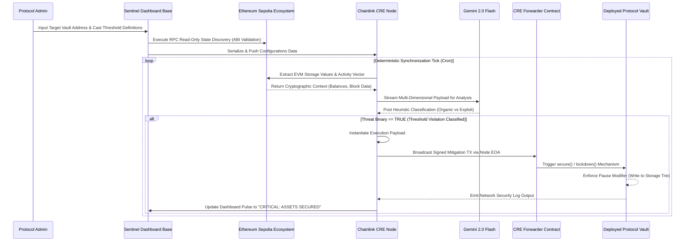

# Sentinel Web Interface

This is the frontend component of the **Sentinel CRE** project. It provides the user interface for protocol setup, AI reasoning logs, and security dashboards.

For full project documentation, setup instructions, and architecture overview, please refer to the [Root README](../README.md).

## Quick Start (Local Development)

```bash
npm run dev
```

Navigate to [http://localhost:3000](http://localhost:3000).


# 🛡️ Sentinel CRE: AI-Orchestrated Security Guardian

Sentinel CRE is an autonomous security solution designed to protect DeFi protocols and digital vaults from exploits, hacks, and extreme market volatility. By combining the **Chainlink Runtime Environment (CRE)** with **Gemini AI**, Sentinel provides 24/7 proactive monitoring and automated intervention.

---

## 🌟 Overview

In the fast-moving world of DeFi, minutes can mean millions. Sentinel CRE acts as a "Digital Bodyguard" for your smart contracts. Unlike traditional passive monitoring, Sentinel analyzes on-chain data in real-time using cutting-edge AI to detect anomalies and execute preemptive safeguards (like circuit breakers or withdrawal pauses) before malicious actors can drain assets.

### Key Capabilities
- **Autonomous Monitoring**: Continuous loops powered by Chainlink CRE.
- **AI Reasoning**: Gemini 2.0 Flash analyzes TVL shifts and provides "human-like" security reasoning.
- **On-Chain Action**: Automated triggers to pause or secure vaults via smart contract interactions.
- **Security Dashboard**: A premium, real-time interface for protocol owners to track security health.

---

## 🏗️ Technical Stack

- **Frontend**: [Next.js 15+](https://nextjs.org/) with Tailwind CSS (Premium Dark Mode UI).
- **Core Engine**: [Chainlink Runtime Environment (CRE)](https://docs.chain.link/cre).
- **Intelligence**: [Google Gemini 2.0 Flash](https://aistudio.google.com/) for risk analysis.
- **Connectivity**: [Ethers.js](https://docs.ethers.org/v6/) & [Viem](https://viem.sh/).
- **Blockchain**: Sepolia Testnet (Target Environment).

---

## 🚀 Getting Started

Sentinel is divided into two main components: the **Web Interface** and the **CRE Sentinel Node**.

### 1. Prerequisites
- **Node.js** (v18+) or **Bun**.
- A **Gemini API Key** (Get one at [Google AI Studio](https://aistudio.google.com/)).
- A **Web3 Wallet** (Metamask/Coinbase) with Sepolia ETH.

### 2. Installation

Clone the repository and install dependencies:

```bash
# Install frontend dependencies
cd sentinel-web
npm install

# Install dependencies for the CRE logic
cd sentinelCRE/sentinel_cre
npm install
```

### 3. Environment Setup

#### Web Frontend (`/sentinel-web/.env.local`)
Create a `.env.local` file in the `sentinel-web` directory:
```env
NEXT_PUBLIC_THIRDWEB_CLIENT_ID=your_client_id
```

#### CRE Logic (`/sentinel-web/sentinelCRE/sentinel_cre/.env`)
Create a `.env` file in the `sentinel-web/sentinelCRE/sentinel_cre` directory:
```env
PRIVATE_KEY=your_private_key_without_0x
RPC_URL="https://virtual.mainnet.us-west.rpc.tenderly.co/d704263c-1ed4-49a9-b739-85806e15ab0f"
VAULT_ADDRESS=0x4ad0F9D5c075cB10479814F8D9CB874dd7Bfec8B
SENTINEL_ADDRESS=0xd0CC532F55cE6849D5b70E24d6188073F8921621
```

#### Configuration (`/sentinel-web/sentinelCRE/sentinel_cre/config.staging.json`)
Update the `geminiApiKey` with your key in the staging/production config files:
```json
{
  "geminiApiKey": "YOUR_GEMINI_API_KEY",
  ...
}
```

### 🌍 Ethereum Sepolia Deployment Integration

Sentinel smart contracts and execution environments natively interface with the **Ethereum Sepolia Testnet**. This provides a robust, zero-value staging ground that perfectly replicates mainnet EVM execution constraints, gas mechanics, and RPC node latency. Below are the canonically deployed core protocol contracts on Sepolia:

- **Sentinel Core Protocol:** [`0xd0CC532F55cE6849D5b70E24d6188073F8921621`](https://sepolia.etherscan.io/address/0xd0CC532F55cE6849D5b70E24d6188073F8921621)
- **Example Defi Vault:** [`0x4ad0F9D5c075cB10479814F8D9CB874dd7Bfec8B`](https://sepolia.etherscan.io/address/0x4ad0F9D5c075cB10479814F8D9CB874dd7Bfec8B)
- **Chainlink CRE Oracle Forwarder:** [`0x15fc6ae953e024d975e77382eeec56a9101f9f88`](https://sepolia.etherscan.io/address/0x15fc6ae953e024d975e77382eeec56a9101f9f88)

When an initialization script broadcasts transactions to the Sepolia JSON-RPC, the synchronous stdout representation is bound to log payload structures analogous to this protocol handshake:

```text
Deploying contracts with the account: 0xEfD0497f4557b49E84369cfb884B6c7446e11aBA
Vault deployed to: 0x4ad0F9D5c075cB10479814F8D9CB874dd7Bfec8B
Using CRE Forwarder address: 0x15fc6ae953e024d975e77382eeec56a9101f9f88
Sentinel deployed to: 0xd0CC532F55cE6849D5b70E24d6188073F8921621
Setting Sentinel as Vault's guardian via Sepolia TX...
Guardian Handshake complete. Sentinel configured as active guardian.
```

---

## 🛠️ Usage

### Running the Web Dashboard
Starting the frontend allows you to access the Wizard and the Security Reasoning Lab.

```bash
cd sentinel-web
npm run dev
```
Navigate to `http://localhost:3000` (or `3001` if port 3000 is occupied).

### Using the Security Wizard
1. **Setup**: Enter your Protocol Vault address and verify its real-time balance.
2. **Rules**: Define your risk threshold (e.g., if TVL drops by 10% in one hour, trigger a pause).
3. **Reasoning Lab**: View the autonomous "Internal Monologue" of the AI as it conducts security sweeps.
4. **Dashboard**: Monitor the "Pulse" of your protocol's health from a central control room.

---

## ⚙️ Core Technical Workflow & Execution Architecture

The Sentinel protocol functions as a highly deterministic, asymmetric state machine. It abstracts away the heavy compute load of intent-centric monitoring off-chain while maintaining strict on-chain execution guarantees for security interventions. Here is the deeply technical lifecycle of the protocol:

### 1. Zero-Knowledge Initialization & Discovery (Admin Phase)
The lifecycle initiates with the Protocol Administrator using the Sentinel Dashboard wizard. The administrator inputs target metadata, chiefly a **Vault Contract Address** existing on the Ethereum Sepolia network. 
- **EVM Resolution:** The frontend client parses this format string and immediately submits a zero-state read query to an Ethereum Sepolia RPC node to validate ABI adherence and byte-code presence.
- **Threshold Calibration:** The admin statically defines threshold axioms (e.g., maximum allowable TVL slippage within a discrete block boundary). These parameters are configured as an exact metric state mapping, decoupled from the mainnet to prevent configuration exhaustion attacks.

### 2. Autonomous Chainlink CRE Capabilities (Monitoring Phase)
With metadata securely ingested, the **Chainlink Runtime Environment (CRE)** orchestration layer assumes full asynchronous control via scheduled compute environments (defined implicitly by `workflow.yaml`).
- **Cryptographic State Ingestion:** Using Chainlink's specific read-only capabilities natively bound to the Sepolia consensus layer, the CRE daemon invokes continuous background extraction of live Vault state variables (token balances, withdrawal cadence).
- **Consensus Isolation:** Because reads occur directly against Ethereum Sepolia's deterministic state-tries, Sentinel achieves canonical fidelity without accumulating gas burdens natively associated with continuous on-chain metric analysis.

### 3. Asymmetric AI Heuristics & Inference (Analysis Phase)
Unstructured on-chain hex data and localized slippage metrics are transformed into a normalized JSON semantic payload. This payload is synchronously bridged into the **Google Gemini 2.0 Flash** LLM inference endpoint.
- **Intent-Based Anomaly Detection:** Rather than depending purely on simplistic integer limits (which are highly susceptible to flash-loan noise), Gemini evaluates contextual heuristics. It calculates if a simultaneous 40% drain constitutes an ecosystem exploitation vector or a legitimate coordinated migration.
- **Internal Monologue Yield:** Gemini generates a transparent rationale log. If an exploit fingerprint is classified, the model returns a binary `THREAT_DETECTED` signal to the CRE engine, bypassing standard evaluation cycles to trigger instant escalation.

### 4. Deterministic Lockdown Protocol (Enforcement Action)
Once the `THREAT_DETECTED` signal propagates into the CRE, the execution pivot occurs, switching the node from passive monitoring to aggressive intervention.
- **Transaction Assembly:** The CRE node harnesses a funded Externally Owned Account (EOA) instantiated on the Sepolia network. It drafts and signs a localized payload calling the `lockdown()` or `pause()` function.
- **Forwarder Relay Serialization:** The transaction is funneled through the canonical Chainlink CRE Forwarder (`0x15fc6ae953e024d975e77382eeec56a9101f9f88`), establishing rigid proxy authorization.
- **On-Chain State Freeze:** The Sepolia-based `Sentinel.sol` guardian contract captures this invocation, confirms the cryptographic signature hierarchy routing from the CRE, and enforces a global `PAUSED` modifier onto the target protocol Vault. Consequently, at the foundational EVM storage layer, all asset transfers are halted atomically, securing the liquidity before subsequent malicious blocks are minted.

### 📌 System Workflow & Topology Flowchart



## 🧪 CRE Simulation (Backend Engine)
If you want to test the autonomous security engine without the frontend, you can run a local simulation of the Chainlink Runtime Environment logic.

1.  **Navigate to the CRE folder**:
    ```bash
    cd sentinel-web/sentinelCRE/sentinel_cre
    ```
2.  **Run the simulation**:
    ```bash
    cre workflow simulate workflow.yaml --target=staging-settings
    ```
    This will execute the security loop, fetch on-chain balances using Chainlink Capabilities, pass the data to Gemini AI, and show you the decided action in the terminal.

---

## 🏛️ Note for Judges
Sentinel CRE was built to solve the "Reactive Security" problem in DeFi. Most protocols today rely on manual multisig pauses that take hours. Sentinel is:
- **Autonomous**: It runs 24/7 on the Chainlink CRE without human intervention.
- **Reason-Capable**: By using Gemini 2.0 Flash, it doesn't just look at numbers; it "reasons" through the volatility to ensure circuit breakers aren't triggered by normal market moves.
- **Interoperable**: It uses Chainlink's BalanceReader capability to monitor any vault across any linked chain.

---

## 📄 License

This project is licensed under the MIT License.

---

*“Sentinel: Because security shouldn't be an afterthought.”*

